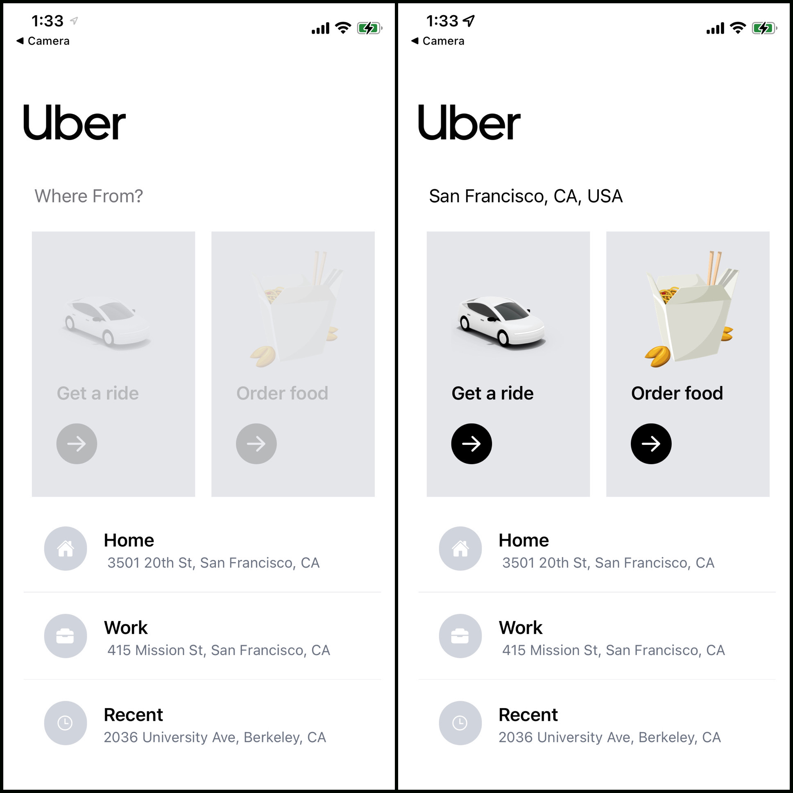

🖥 Link to hosted app:

https://.herokuapp.com/

✏️ Description:

Using React Native, I built an Uber clone application. 
Utilized Google API's including Places, Directions, and Distance Matrix to calculate travel time, distance, cost, and real navigation.

🛠 Technnologies Used:

Language: 
  - JavaScript

Front-End:
  - React Native
  - React Redux
  - Tailwind CSS

Back-End:
  - Node.js
  - Expo
  - Google API's

* As of November 18, 2021 the following features are... 

Functional:
- Get a Ride
  - Enter location and select from Google auto-complete
  - Calculate time, distance, and cost of trip.

Non-Functional:
- Order-Food
- Home, Work, and Recent locations

Instructions: 
1) On the home screen, enter your starting location
2) Select 'Get a Ride' (becomes clickable after entering location)
3) Enter your destination
4) Select your ride (highlights your choice and makes 'Choose' button clickable with your current choice.)

